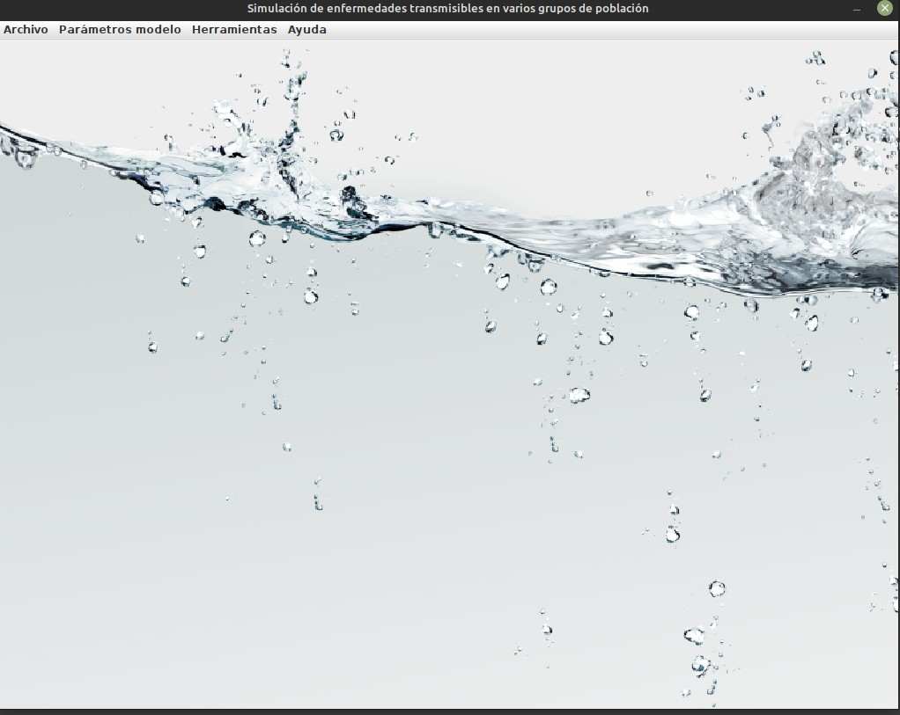
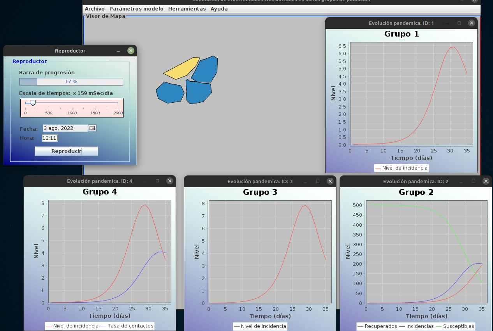
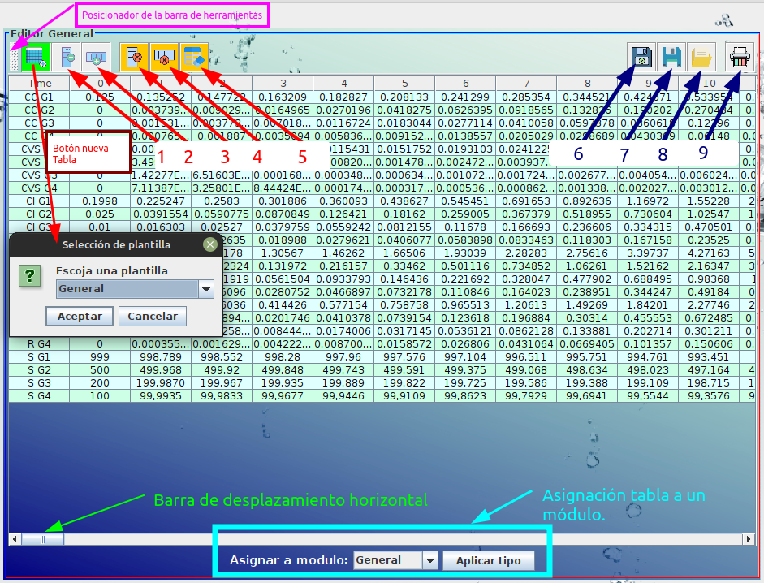
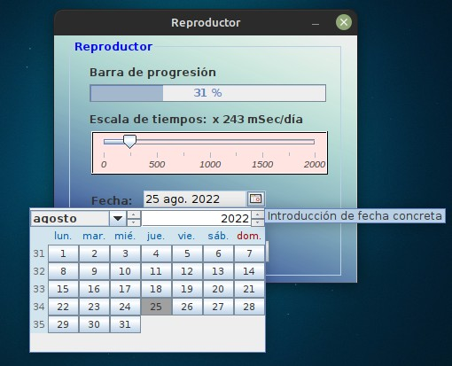
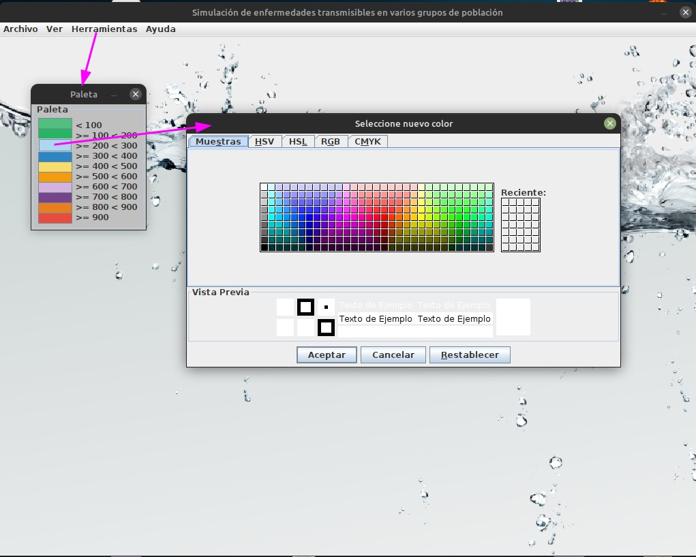
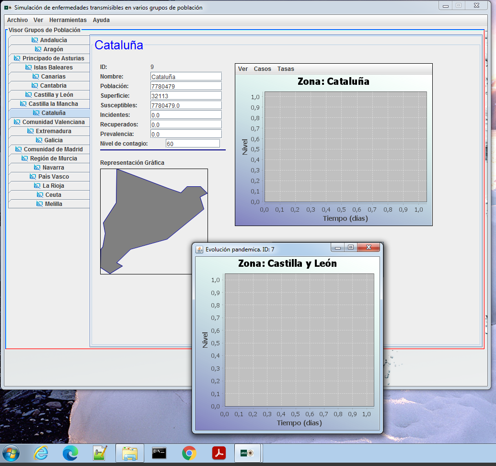
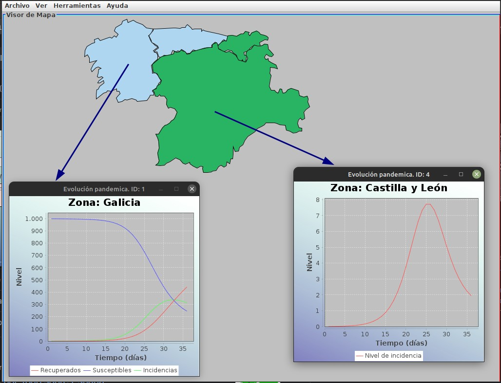
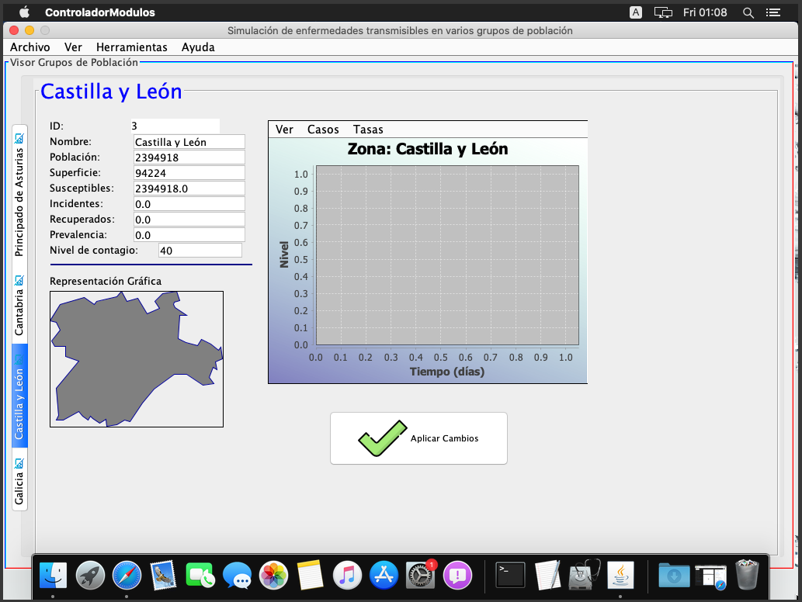
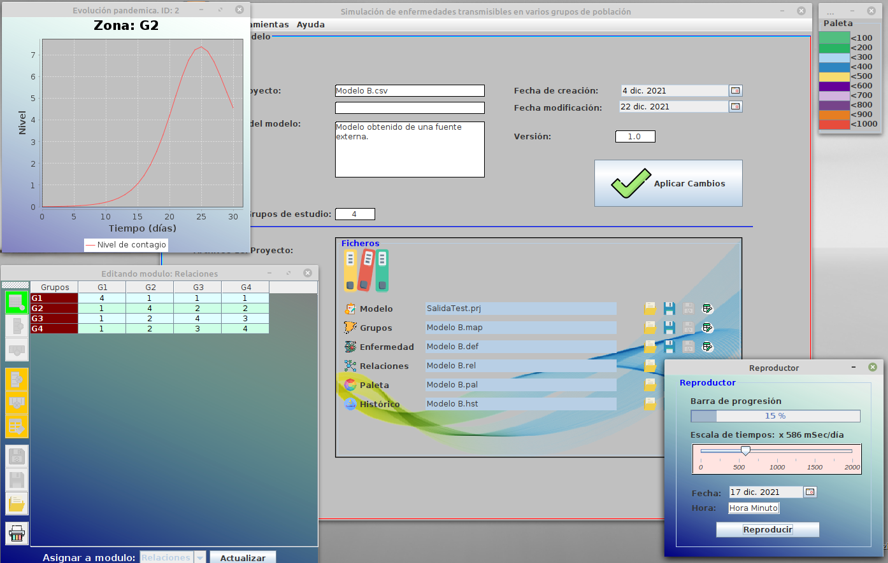

# PFGPandemy

### Updating this main introduction page.

   The Covid-19 pandemic, recognized since March 11, 2020 by the World Health Organization, is the most recent and most worrying example of the importance of studying communicable diseases in a world as connected as the current one.

   Based on the work from Professor Morilla F., an expert on the application of Dynamic Models to Public Health matters, who pays constant attention to the evolution of this epidemic. Who is convinced that more effective measures can be taken for its eradication or mitigation. In his opinion, some of these measures require a better understanding of the transmission mechanisms between different population groups. Simulation environments can contribute to this.
	
   Understanding the importance of cognitive assimilation of the information in a graphical mode, encoraged me to create this polivalent, multiplatform and advanced tool. What brings this powerful software to any corporation, educational, investigation center, healthcare system without integration problems. Allowing excange datas and results among any system.

   In this project, a specific simulation environment has been developed in order to recreate the evolution of a communicable disease in various population groups. The environment, which is based on a [dynamic SIR model](https://en.wikipedia.org/wiki/Compartmental_models_(epidemiology)#The_SIR_model) of disease, has a parameterization interface for each of the parts of the model.
	
   Also the system has several independent modules working together with the application, but it is focused on the representation of population groups and contagion levels on a map, such as:

* A map drawing tool for area defintions of each population (country, state, county...).
* A general data editing module in table format.
* An editor for defining a color scale.
* A population area editor.
* A scenario player with time control.
* Individual windows by population to study the lineal graph of each SIR parameter.
* Geographial evolution of the simulated illness spread by level and color.

   The Tool is full functional and getting new features, improvements and visual adjustments in every release.

### To do list
- [ ] Adding language support for English, German and French versions.
- [ ] Updating WikiDoc for user guide
- [ ] Adjusting some windows areas.
- [ ] Adding SVG maps import.

---

#Some Images Spanish version for Demo

